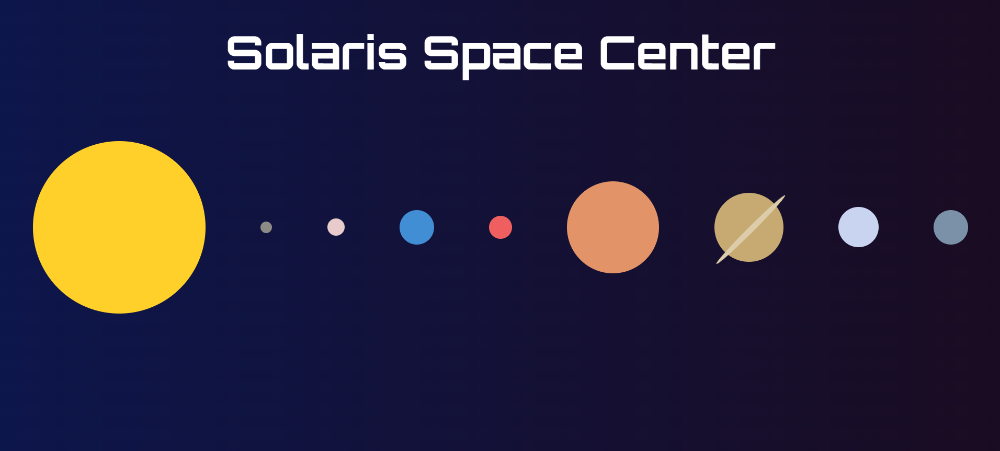

# Solaris Space Center App

View it live at: https://egrenb3s23.github.io/exercise-js-solaris/

## Introduction

Hello all future code astronauts!

Now you are about to embark on an amazing space adventure where you will build your very own interactive space application by combining your recently aquired skills in vanilla JavaScript, with HTML & CSS. Your mission? To create a portal that takes us on an exciting journey through our very own corner of the universe - our solar system!

You will get to build and partially design a web application that takes the user on a fascinating journey through the solar system. Your application will function as a sort of space encyclopedia, where the user can explore and learn more about our closest neighbors in space - the planets!

## Mission brief

### Requirements

- Your application is expected to consist of three pages:
  - Home/Navigation Page
  - Single Planet Page
  - Favorite Planets Page
- You are expected to incorporate and use the following in your code:
  - Arrays & Objects
  - Functions
  - DOM Manipulation
  - Error Handling
  - Local Storage
  - Asynchronous Programming
- When hovering a planet in the navigation, the name of the planet must be displayed to the user.
- All code must be encapsulated in functions, no global variables.
- Your application must be responsive and work on all screen sizes over 990 pixels.

### Page Explanation

#### Home / Navigation Page

Here you will create a navigation containing all of the celestial bodies that you fetch from the provided API, by following [this Figma sketch](https://www.figma.com/design/Snw8n1gba7Mbk6TCLEAB1A/JS-%2F-Solaris) (you could use the design from the header image of this task). All celestial bodies should be relatively proportional in size to each other. A click on a planet should redirect the user to the Single Planet Page. You must add a link to the Favorites Page.

#### Single Planet Page

Here you will incorporate the [design from the Figma sketch](https://www.figma.com/design/Snw8n1gba7Mbk6TCLEAB1A/JS-%2F-Solaris). Depending on witch planet you have clicked on, the color of the planet should vary. The transparent star background can be found in the _assets_-folder. You must also add a button where your user can add this planet to his/her favorites. If the visited planet is already a favorite, the button can be used to remove the planet from his/her favorites. You should also create a link back to the Home Page.

#### Favorites Page

Here you get to choose your own design, but the theme should be in the same universe as the Figma sketches. Here the user will be able to see witch planets that are in his/her favorites list. A click on one of the planets here will redirect the user to the Single Planet Page for that planet. There must be a link on this page that takes the user back to the Home Page.

### Group members

Erik Hallgren,
Fanny Silva Borquez,
Jessica Hansson,
Anton Adamse
